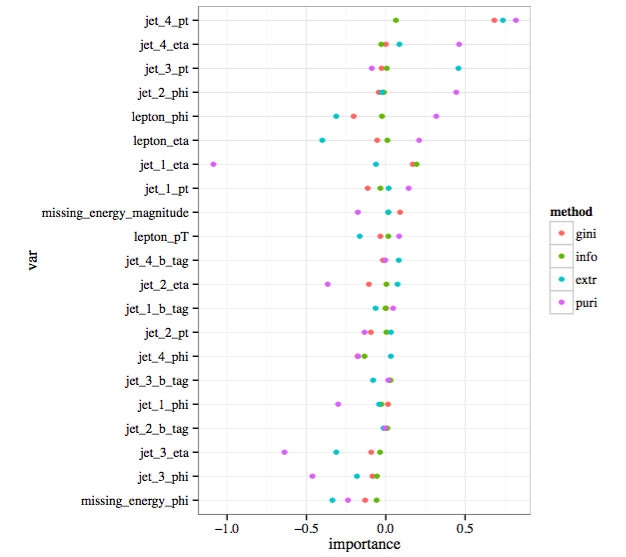

```{r hooks, echo = FALSE}
knitr::opts_chunk$set(message = FALSE, warning = FALSE, cache = FALSE)
ggplot2::theme_set(ggplot2::theme_bw(base_family="serif"))
```

##Background

  - The random forest [@breiman2001random] is an ensemble method implemented in `R` [@R] in the `randomForest` package [@randomForest]. 
  - General framework for building a model by combining trees, however implementation is very specific - Gini splitting criteria
  - The `forestr` package [@forestr] implements the random forest methodology with a choice of splitting criteria, namely:

    - Gini,
    - Information,
    - One-sided Extremes, and
    - One-sided Purity.
  
##One-sided splitting methods

  - One-sided extremes and one-sided purity introduced by Buja and Lee [-@buja2001data] as a means to "identify pure or extreme buckets" in the data
  - Perpendicular to the conventional splitting methods that attempt to perform equally well on both sides of the split 
  - The one-sided splitting methods instead search for "interesting subsets of data as opposed to modelling all of the data equally well." [@buja2001data, pp. 1]
  
  
 Criteria | Regression Trees                             | Classification Trees
------------------- | ---------------------------------------------| ----------------------------------
One-sided purity    | $\min\{\hat{\sigma}^2_L, \hat{\sigma}^2_R\}$ | $\min\{p_L^0p_L^1, p_R^0p_R^1\}$
One-sided extremes  | $\min\{\hat{\mu}_L, \hat{\mu}_R\}$           | $\max\{p_L^1, p_R^1\}$

<div class = "notes">
You may think to yourself, "Why would I need this? The `randomForest` package works well and is blazing fast!" I would agree. If Gini is your splitting criteria of choice and your data are fairly balanced, then I would recommend using `randomForest`. If, however, your data is not evenly spread across the classification buckets or there is a particular class of data that you care more about classifying correctly (especially if it is a small minority of cases), then you may turn to a one-sided extremes or one-sided purity splitting function. This is the case often with detection problems, for example cancer detection in patients or detection of the Higgs particle from measurements by particle detectors in an accelerator.
</div>

##Higgs Example

  - Monte Carlo simulations to resemble properties measured by particle detectors in an accelerator to detect the Higgs particle [@baldi2014searching]
  - 21 features that are kinematic properties measured by the particle detectors in the accelerator
  - Attempt to predict the detection of the Higgs particle using a random forest with different splitting mechanisms for some degrees of unbalancedness 
  - Created small subset, 200 observations, with desired unbalancedness level (25%)
  
<div class="notes">
More unbalanced levels in the paper and as datasets within the package, but only have time to look at one today.
</div>
  
##Features

```{r libraries, cache=FALSE, echo=FALSE}
#load libraries
library(forestr)
library(dplyr)
library(tidyr)
library(ggplot2)
library(GGally)
library(knitr)
set.seed(503503) #reproducibility

#load datasets
data(higgs_25)
data(test_higgs_25)
```

```{r scatter, echo=FALSE, fig.width=9, fig.height=5, cache=TRUE}
#axis label manipulation from: 
#http://stackoverflow.com/questions/28427572/manipulating-axis-titles-in-ggpairs-ggally

#paired scatterplot
ggpairs(higgs_25, columns = 2:22, color = "class",
                  axisLabels = "none",
                  columnLabels = 1:21,
                  alpha = .5, 
                  upper = list(continuous = 'blank')) 
```

<div class="notes">
move on quickly
</div>

##Features (Cont'd)
```{r scatter2, echo=FALSE, fig.width=9, fig.height=5, cache=TRUE}
#axis label manipulation from: 
#http://stackoverflow.com/questions/28427572/manipulating-axis-titles-in-ggpairs-ggally

#paired scatterplot
g <- ggpairs(higgs_25, columns = c(19, 15, 20, 13, 4), color = "class",
                  alpha = .5)
print(g, bottom = .5)
```

<div class="notes">
class 0 is red and class 1 is blue. 
1. No clear separation between classes -- random forest may not be successful
2. there are some slight differences between classes for these variables, so maybe we can detect something
</div>


##Fitting {.smaller}

```{r rf_25, eval=FALSE}
#train forests
rf_gini_25 <- forestr(class ~ ., data = higgs_25 %>% select(-starts_with("m_")))
rf_info_25 <- forestr(class ~ ., data = higgs_25 %>% select(-starts_with("m_")), 
                      parms = list(split = "information"))
### <b>
rf_extr_25 <- forestr(class ~ ., data = higgs_25 %>% select(-starts_with("m_")), 
                  method = "extremes", parm = list(classOfInterest = "1"))
rf_puri_25 <- forestr(class ~ ., data = higgs_25 %>% select(-starts_with("m_")), 
                      method = "purity")
### </b>

#test four forests
rf_gini.pred_25 <- predict(rf_gini_25, test_higgs_25 %>% select(-starts_with("m_")))
rf_info.pred_25 <- predict(rf_info_25, test_higgs_25 %>% select(-starts_with("m_")))
rf_extr.pred_25 <- predict(rf_extr_25, test_higgs_25 %>% select(-starts_with("m_")))
rf_puri.pred_25 <- predict(rf_puri_25, test_higgs_25 %>% select(-starts_with("m_")))
```

```{r puri_obj, echo=FALSE}
#save(rf_gini_25, rf_info_25, rf_extr_25, rf_puri_25, 
#     rf_gini.pred_25, rf_info.pred_25, rf_extr.pred_25, rf_puri.pred_25, file = "cache/forests.rda")
load("cache/forests.rda")
```

<div class = "notes">
1. training four random forests to our dataset, one for each available splitting method. 
2. specify new splitting criteria through method = extremes or purity 
3. pass through class of interest, in this case 1 for detecting a higgs particle
</div>

##Results

####Out-of-bag

```{r rf_25_tables, echo=FALSE}
#oob and class 1 errors
rbind(data.frame(Gini = rf_gini_25$oob, 
                 Information = rf_info_25$oob, 
                 Extremes = rf_extr_25$oob, 
                 Purity = rf_puri_25$oob),
      data.frame(Gini = ifelse("1" %in% rownames(rf_gini_25$misclass), 
                               1-rf_gini_25$misclass["1", "1"]/sum(rf_gini_25$misclass[, "1"]),
                               1), 
                 Information = ifelse("1" %in% rownames(rf_info_25$misclass), 
                                      1-rf_info_25$misclass["1", "1"]/sum(rf_info_25$misclass[, "1"]), 
                                      1), 
                 Extremes = ifelse("1" %in% rownames(rf_extr_25$misclass),
                                   1-rf_extr_25$misclass["1", "1"]/sum(rf_extr_25$misclass[, "1"]),
                                   1), 
                 Purity = ifelse("1" %in% rownames(rf_puri_25$misclass),
                                 1-rf_puri_25$misclass["1", "1"]/sum(rf_puri_25$misclass[, "1"]),
                                 1))) -> oob_table 
rownames(oob_table) <-  c("OOB Error", "Class of Interest Error")
oob_table %>%
  kable(digits = 4, row.names = TRUE)
```

<br/>

####Test predictions

```{r rf_25_tables_test, echo=FALSE}
rf_gini.pred_25$misclass <- table(rf_gini.pred_25$response, test_higgs_25[, "class"])
rf_info.pred_25$misclass <- table(rf_info.pred_25$response, test_higgs_25[, "class"])
rf_extr.pred_25$misclass <- table(rf_extr.pred_25$response, test_higgs_25[, "class"])
rf_puri.pred_25$misclass <- table(rf_puri.pred_25$response, test_higgs_25[, "class"])

rbind(data.frame(Gini = sum(rf_gini.pred_25$response != test_higgs_25[, "class"])/nrow(test_higgs_25), 
                 Information = sum(rf_info.pred_25$response != test_higgs_25[, "class"])/nrow(test_higgs_25), 
                 Extremes = sum(rf_extr.pred_25$response != test_higgs_25[, "class"])/nrow(test_higgs_25), 
                 Purity = sum(rf_puri.pred_25$response != test_higgs_25[, "class"])/nrow(test_higgs_25)),
      data.frame(Gini = ifelse("1" %in% rownames(rf_gini.pred_25$misclass), 
                               1-rf_gini.pred_25$misclass["1", "1"]/sum(rf_gini.pred_25$misclass[, "1"]),
                               1), 
                 Information = ifelse("1" %in% rownames(rf_info.pred_25$misclass), 
                                      1-rf_info.pred_25$misclass["1", "1"]/sum(rf_info.pred_25$misclass[, "1"]), 
                                      1), 
                 Extremes = ifelse("1" %in% rownames(rf_extr.pred_25$misclass),
                                   1-rf_extr.pred_25$misclass["1", "1"]/sum(rf_extr.pred_25$misclass[, "1"]),
                                   1), 
                 Purity = ifelse("1" %in% rownames(rf_puri.pred_25$misclass),
                                 1-rf_puri.pred_25$misclass["1", "1"]/sum(rf_puri.pred_25$misclass[, "1"]),
                                 1))) -> test_table
rownames(test_table) <-  c("Overall Error", "Class of Interest Error")
test_table %>%
  kable(digits = 4, row.names = TRUE)
```

<div class = "notes">
This table contains the out-of-bag error for each of the four random forests. It is clear that if we are aiming for simply overall error rates, Gini or information splitting are superior, however that is only because they ignore the smaller class when possible. If we instead look at the percent correct specified of our class of interest (class 1) then we see both one-sided methods are the only ones that actually classify any of our class of interest correctly.
</div>

##Importance
```{r importance, eval=FALSE}
rf_gini.imp_25 <- importance(rf_gini_25)
rf_info.imp_25 <- importance(rf_info_25)
rf_extr.imp_25 <- importance(rf_extr_25)
rf_puri.imp_25 <- importance(rf_puri_25)
```

<div class = "notes">
`proximity` function which calculates an $N \times N$ matrix that captures the number of times a pair of observations end up in the same terminal node within each of the $B$ trees in the forest. The second utility is the `importance` function, which calculates the variable importance within the forest for each variable in the dataset. Variable importance is a unique feature of random forests that is essentially a permutation of each variable's values to assess its effect on the forest.
</div>

##Importance Cont'd

 
<div class = "notes">
different splitting methods can help us to identify those variables that are perhaps most important for detecting these rare events. For example, `jet_4_pt` appears to be the most important variable for both one-sided methods, but it is also the of the highest importance for Gini so this may not be a differentiationg variable. The variables that do seem to differentiate between the methods include `jet_3_pt`, `jet_4_eta`, `jet_2_phi`, and `lepton_phi`. What's interesting here is that the one-sided purity places high importance on `jet_4_eta`, `jet_2_phi`, and `lepton_phi`, while the one-sided extremes places high importance on `jet_3_pt`, even though they achieve similar levels of detection for our class of interest. This points to the possibility of potentially ensembling the ensemble methods, and stacking these two methods for a potential classification boost of the class of interest.
</div>

##Implementation
  - Written in `R`
  - Wraps random forest methodology around modified `rpart` stubs


<div class = "notes">
1. forestr is a truly flexible random forest because of user specified splitting mechanisms in rpart
2. steps of how it uses R part
  - stubbing
  - random select variables
  - splitting data
  - split left/right nodes via another stub
3. itree unstable => take splitting functions and put them in rpart
</div>

##Remarks

  -  Written completely in `R` $\Rightarrow$ slow 
    - Next step would be to rewrite the inner workhorse functions in `C++` to help with a speedup 
    - Alternative could be to alter the `randomForest` package to include alternative splitting mechanisms, but this package is written in `Fortran`, and so would need some updating first

<div class="notes">
don't read first bullet
</div>

##Lessons learned


##Lessons learned
  - Writing an `R` package is easy with `devtools`
  - Writing generalized code is hard
    - Writing generalized code without bugs is harder
    - Writing generalized code that isn't slow is even harder 
      - Editing other peoples' code is **hardest**
      - Especially in a language not fluent in (`Fortran` and `C`)
  - Open source community is great
    - Communication with author of `itree` helped to find the issues
  - S3 classes are really neat and easy 
</div>

#Thanks!

Questions?

ajkaplan@iastate.edu

#Appendix

##Installation

`forestr` and and accompanying dependency package `rpart` can be installed from GitHub in `R` with `devtools` [@devtools].

```r
library(devtools)
install_github("andeek/rpart")
install_github("andeek/forestr")
```

##References {#refs}
  
  
