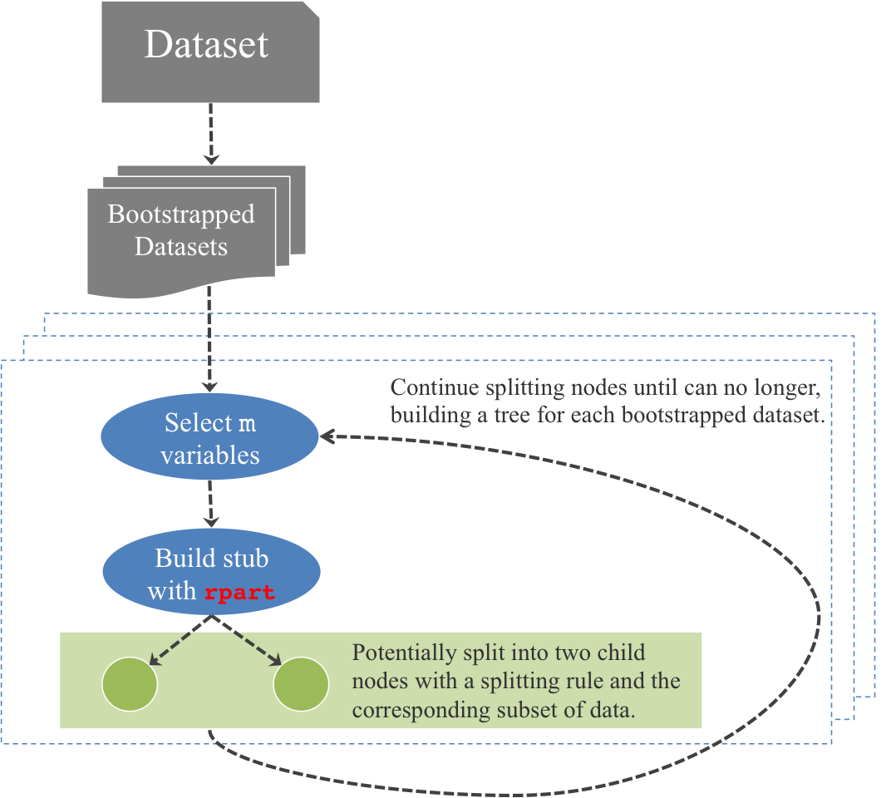

```{r hooks, echo = FALSE}
knitr::opts_chunk$set(message = FALSE, warning = FALSE, cache = TRUE, autodep=TRUE, cache.lazy=FALSE )
ggplot2::theme_set(ggplot2::theme_bw(base_family="serif"))
```

#Background

The random forest [@breiman2001random] is an ensemble method that combines bagged (bootstap aggregated) classification and regression trees with a random variable selection at each node in the tree. This methodology is implemented in `R` [@R] in the `randomForest` package [@randomForest]. The random forest methodology is a general framework for building a model by combining trees, however its implementation is very specific. Within the `randomForest` package, a Gini splitting criteria is used as the only possible splitting mechanism within the trees.

The `forestr` package [@forestr] implements the random forest methodology with a choice of splitting criteria, namely:

  - Gini,
  - Information,
  - One-sided Extremes, and
  - One-sided Purity.
  
The last two splitting criteria are introduced by Buja and Lee [-@buja2001data] as a means to "identify pure or extreme buckets" in the data. These methods are perpendicular to the conventional splitting methods of Gini and information that attempt to perform equally well on both sides of the split. The one-sided splitting methods instead search for "interesting subsets of data as opposed to modelling all of the data equally well." [@buja2001data, pp. 1]

#Why

You may think to yourself, "Why would I need this? The `randomForest` package works well and is blazing fast!" I would agree. If Gini is your splitting criteria of choice and your data are fairly balanced, then I would recommend using `randomForest`. If, however, your data is not evenly spread across the classification buckets or there is a particular class of data that you care more about classifying correctly (especially if it is a small minority of cases), then you may turn to a one-sided extremes or one-sided purity splitting function. This is the case often with detection problems, for example cancer detection in patients or detection of the Higgs particle from measurements by particle detectors in an accelerator.

#Installation

`forestr` and and accompanying dependency package `rpart` can be installed from GitHub in `R` with `devtools` [@devtools].

```r
library(devtools)
install_github("andeek/rpart")
install_github("andeek/forestr")
```

#Higgs Example

As an example of `forestr` in use, we will focus on comparing the one-sided extremes and one-sided purity methods to Gini and information splitting random forests. Since these methods were created to better handle unbalanced classification tasks where one class is of more importance to be classified correctly, we will test these splitting criteria with varying levels of unbalanced data in a 2-class classification problem.

The data come from the UCI Machine Learning repository, and are produced using Monte Carlo simulations to resemble properties measured by particle detectors in an accelerator to detect the Higgs particle [@baldi2014searching]. The variable we wish to predict is `class`, which encodes if a Higgs particle was detected (class 1) or not (class 0). There are 21 features that are kinematic properties measured by the particle detectors in the accelerator and seven features that are functions of the first 21 features. A paired scatterplot of all 21 low level features is available in the figure below. We will work with these low level freatures in an attempt to predict the detection of the Higgs particle using a random forest with different splitting mechanisms for varying degrees of unbalancedness.

I have created smaller datasets from this large dataset by sampling observations to create the percentage of unbalancedness desired. The levels of unbalancedness to be tested are 5%, 10%, and 25%. Each of these samples of the data as well as test data for each level of unbalancedness are included in the `forestr` package and can be loaded with the function `data(higgs_[percentage level of unbalancedness])`, for example `data(higgs_10)` loads the 10% unbalanced dataset and `data(test_higgs_10)` the corresponding test dataset. The training and test datasets each have $200$ observations.

We will start with the created dataset with 25% detected particles and demonstrate how to create a random forest with `forestr` of differing split criteria.

```{r libraries, cache=FALSE}
#load libraries
library(forestr)
library(dplyr)
library(tidyr)
library(ggplot2)
library(GGally)
library(knitr)
set.seed(503503) #reproducibility

#load datasets
data(higgs_25)
data(test_higgs_25)
```

```{r scatter, fig.height=9, fig.width=6}
#paired scatterplot
ggpairs(higgs_25, columns = 2:22, color = "class",
        columnLabels = 1:21, axisLabels = "none",
        alpha = .5, 
        upper = list(continuous = 'blank')) 
```

Having taken a look at the raw data, we will move forward with training four random forests to our dataset, one for each available splitting method. The table below contains the out-of-bag error for each of the four random forests. It is clear that if we are aiming for simply overall error rates, Gini or information splitting are superior, however that is only because they ignore the smaller class when possible. If we instead look at the percent correct specified of our class of interest (class 1), also in the table, then we see both one-sided methods are the only ones that actually classify any of our class of interest correctly.

```{r rf_25}
#train forests
rf_gini_25 <- forestr(class ~ ., data = higgs_25 %>% select(-starts_with("m_")))
rf_info_25 <- forestr(class ~ ., data = higgs_25 %>% select(-starts_with("m_")), 
                      parms = list(split = "information"))
rf_extr_25 <- forestr(class ~ ., data = higgs_25 %>% select(-starts_with("m_")), 
                  method = "extremes", parm = list(classOfInterest = "1"))
```

```{r rf_25_2}
rf_puri_25 <- forestr(class ~ ., data = higgs_25 %>% select(-starts_with("m_")), 
                      method = "purity")
```

```{r rf_25_3}
#test four forests
rf_gini.pred_25 <- predict(rf_gini_25, test_higgs_25 %>% select(-starts_with("m_")))
rf_info.pred_25 <- predict(rf_info_25, test_higgs_25 %>% select(-starts_with("m_")))
rf_extr.pred_25 <- predict(rf_extr_25, test_higgs_25 %>% select(-starts_with("m_")))
```

```{r rf_25_4}
rf_puri.pred_25 <- predict(rf_puri_25, test_higgs_25 %>% select(-starts_with("m_")))
```

```{r rf_25_tables, echo=FALSE}
#oob and class 1 errors
rbind(data.frame(Gini = rf_gini_25$oob, 
                 Information = rf_info_25$oob, 
                 Extremes = rf_extr_25$oob, 
                 Purity = rf_puri_25$oob),
      data.frame(Gini = ifelse("1" %in% rownames(rf_gini_25$misclass), 
                               1-rf_gini_25$misclass["1", "1"]/sum(rf_gini_25$misclass[, "1"]),
                               1), 
                 Information = ifelse("1" %in% rownames(rf_info_25$misclass), 
                                      1-rf_info_25$misclass["1", "1"]/sum(rf_info_25$misclass[, "1"]), 
                                      1), 
                 Extremes = ifelse("1" %in% rownames(rf_extr_25$misclass),
                                   1-rf_extr_25$misclass["1", "1"]/sum(rf_extr_25$misclass[, "1"]),
                                   1), 
                 Purity = ifelse("1" %in% rownames(rf_puri_25$misclass),
                                 1-rf_puri_25$misclass["1", "1"]/sum(rf_puri_25$misclass[, "1"]),
                                 1))) -> oob_table 
rownames(oob_table) <-  c("OOB Error", "Class of Interest Error")
oob_table %>%
  kable(digits = 4, row.names = TRUE, caption = "\\label{tab:oob}Out-of-bag errors and errors for classifying the class of interest (class 1) for the random forests using the four different splitting criteria. One-sided methods are the only ones that actually classify any of our class of interest (class 1) correctly.")
```

We can also look at the test error for each method in the same way, as in the table below. The story with the test data matches the out-of-bag samples. Once again, the one-sided methods both have a higher overall error rate, but are the only methods to correctly classify any of the class of interest in our test data, with one-sided extremes having slightly lower error rate.

```{r rf_25_tables_test, echo=FALSE}
rf_gini.pred_25$misclass <- table(rf_gini.pred_25$response, test_higgs_25[, "class"])
rf_info.pred_25$misclass <- table(rf_info.pred_25$response, test_higgs_25[, "class"])
rf_extr.pred_25$misclass <- table(rf_extr.pred_25$response, test_higgs_25[, "class"])
rf_puri.pred_25$misclass <- table(rf_puri.pred_25$response, test_higgs_25[, "class"])

rbind(data.frame(Gini = sum(rf_gini.pred_25$response != test_higgs_25[, "class"])/nrow(test_higgs_25), 
                 Information = sum(rf_info.pred_25$response != test_higgs_25[, "class"])/nrow(test_higgs_25), 
                 Extremes = sum(rf_extr.pred_25$response != test_higgs_25[, "class"])/nrow(test_higgs_25), 
                 Purity = sum(rf_puri.pred_25$response != test_higgs_25[, "class"])/nrow(test_higgs_25)),
      data.frame(Gini = ifelse("1" %in% rownames(rf_gini.pred_25$misclass), 
                               1-rf_gini.pred_25$misclass["1", "1"]/sum(rf_gini.pred_25$misclass[, "1"]),
                               1), 
                 Information = ifelse("1" %in% rownames(rf_info.pred_25$misclass), 
                                      1-rf_info.pred_25$misclass["1", "1"]/sum(rf_info.pred_25$misclass[, "1"]), 
                                      1), 
                 Extremes = ifelse("1" %in% rownames(rf_extr.pred_25$misclass),
                                   1-rf_extr.pred_25$misclass["1", "1"]/sum(rf_extr.pred_25$misclass[, "1"]),
                                   1), 
                 Purity = ifelse("1" %in% rownames(rf_puri.pred_25$misclass),
                                 1-rf_puri.pred_25$misclass["1", "1"]/sum(rf_puri.pred_25$misclass[, "1"]),
                                 1))) -> test_table
rownames(test_table) <-  c("Overall Error", "Class of Interest Error")
test_table %>%
  kable(digits = 4, row.names = TRUE, caption = "\\label{tab:test-error}Overall test errors and test errors for classifying the class of interest (class 1) for the random forests using the four different splitting criteria. Once again, the one-sided methods both have a higher overall error rate, but are the only methods to correctly classify any of the class of interest in our test data, with one-sided extremes having slightly lower error rate.")
```

There are two additional utility functions available in the `forestr` package for handling random forests. The first is the `proximity` function which calculates an $N \times N$ matrix that captures the number of times a pair of observations end up in the same terminal node within each of the $B$ trees in the forest. The second utility is the `importance` function, which calculates the variable importance within the forest for each variable in the dataset. Variable importance is a unique feature of random forests that is essentially a permutation of each variable's values to assess its effect on the forest. For each of the four random forests detailed above we can look at the importance of each variable using the `importance` function in `forestr`. The resulting variable importances are found below.

```{r importance}
rf_gini.imp_25 <- importance(rf_gini_25)
rf_info.imp_25 <- importance(rf_info_25)
rf_extr.imp_25 <- importance(rf_extr_25)
rf_puri.imp_25 <- importance(rf_puri_25)
```

```{r importance-plot, echo=FALSE, fig.height=6, fig.width=6}
rbind(data.frame(method = "gini", rf_gini.imp_25),
      data.frame(method = "info", rf_info.imp_25),
      data.frame(method = "extr", rf_extr.imp_25),
      data.frame(method = "puri", rf_puri.imp_25)) -> importance

#weirdness
if(length(importance[is.na(importance$var), "var"]) > 0) importance[is.na(importance$var), "var"] <- "jet_3_phi"

importance %>%
  group_by(var) %>%
  summarise(max_imp = max(importance)) %>%
  arrange(desc(max_imp)) %>%
  mutate(revrank = min_rank(max_imp)) -> order

importance$var <- factor(importance$var, levels = rev(as.character(order$var)))

importance %>%
  ggplot() +
  geom_point(aes(importance, var, colour = method))
```

Looking at the variable importance across models with different splitting methods can help us to identify those variables that are perhaps most important for detecting these rare events. For example, `jet_4_pt` appears to be the most important variable for both one-sided methods, but it is also the of the highest importance for Gini so this may not be a differentiationg variable. The variables that do seem to differentiate between the methods include `jet_3_pt`, `jet_4_eta`, `jet_2_phi`, and `lepton_phi`. What's interesting here is that the one-sided purity places high importance on `jet_4_eta`, `jet_2_phi`, and `lepton_phi`, while the one-sided extremes places high importance on `jet_3_pt`, even though they achieve similar levels of detection for our class of interest. This points to the possibility of potentially ensembling the ensemble methods, and stacking these two methods for a potential classification boost of the class of interest.

#Implementation

The `forestr` package is written entirely in `R` and wraps the random forest methodology around a modified `rpart` package [@rpart] to include the additional splitting criteria. The modified `rpart` can be found at http://github.com/andeek/rpart and installed using the command 

```r
devtools::install_github("andeek/rpart")
```

The `rpart` functionality is used to create stub trees (trees of maximum depth one) from a random selection of variables on the bootstrapped data at each eligible node. A detailed diagram of how this works can be found in the figure below. The dataset is used to create $B$ bootstrap sampled datasets which are then used to create $B$ trees. Each tree is created by recursively splitting each terminal node on a set of randomly sampled $m$ variables from the dataset until this process can continue no longer. `forestr` uses `rpart` to split each terminal node at most depth of one.




After the $B$ trees are created, there must be a mechanism by which one can predict new data classification (or regression values) from the created "forest" trees. Since they are no longer `rpart` trees, there is no built in method to accomplish this. The solution is to use the path generated by `rpart` as a means to filter the new dataset into predicted nodes in the forest tree and assign those observations the value predicted by the forest tree. After predicting the forest tree value for each observation of new data, the predictions are combined via a majority voting method for classification or a bootstrap average for regression trees, which follows the standard random forest method.

The modifications to `rpart` for the additional splitting functions were first introduced in the package `itree` [@itree], however this package was build on an old and slightly unstable version of `rpart`, making it unusable as is within the `forestr` framework. Fortunately, `rpart` allows for the addition of user defined splitting criterion using either `C` functions or `R` functions written by the user. The three functions a user must define are

init

:   The initialization function that initializes the parameters and data passed to the splitting function

eval

:   The evaluation function that creates a label for each node and evaluated the deviance at that node

split
    
:   The splitting function is the workhorse function that actually attempts to find the split point for the data based on a variable

As such, the modified `rpart` contains the additional `C` splitting functions provided from the `itree` package, but within the more stable current release of `rpart`, version 4.1-9. 

By using `rpart` to create the stubs in `forestr`, this allows `forestr` to be a truly flexible method for implementing the random forest methodology. If desired, a user can create her own splitting function by following the framework defined in `rpart` and extending the random forest methodology to adapt to a new splitting mechanism. For details on creating a user defined splitting mechanism, please see the [vignette](http://cran.r-project.org/web/packages/rpart/vignettes/usercode.pdf) that describes the process in `rpart`.

#References
